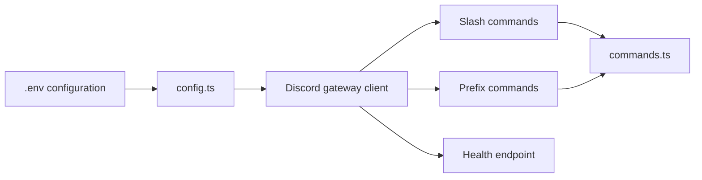

<p align="center">
  
</p>

<h1 align="center">Restore-Base</h1>

<p align="center">
  A production-minded Discord bot wrapper inspired by RestoreBase.
</p>

[](https://github.com/zombyrra/Restore-Base/actions/workflows/ci.yml)
[](./LICENSE)


## Overview

Restore-Base is a small, self-hostable Discord bot foundation for teams that want a clean starting point instead of a tangled demo. It ships with typed configuration, gateway lifecycle handling, slash command registration, prefix command support, and a health endpoint that can be wired into a host or uptime monitor.

This public repo is intentionally scoped. It does not include the private RestoreBase dashboard, billing, database schema, member recovery system, workspace automation, or production credentials.

## What It Includes

- Discord gateway client setup with `discord.js` v14
- Environment validation with `zod`
- `/ping` slash command registration
- `!ping` prefix command example
- Express health endpoint at `/health`
- Strict TypeScript configuration
- GitHub Actions CI
- Contribution, security, and issue templates

## Architecture



The wrapper keeps the public surface deliberately simple:

- `src/index.ts` owns process startup, Discord gateway listeners, and graceful error paths.
- `src/config.ts` validates runtime configuration before the bot connects.
- `src/commands.ts` owns command registration and command handlers.
- `src/health.ts` exposes readiness details for deployment platforms.

## Quick Start

```bash
npm install
cp .env.example .env
npm run dev
```

Fill in `.env` before starting:

```bash
DISCORD_BOT_TOKEN=your_bot_token
DISCORD_CLIENT_ID=your_application_client_id
DISCORD_GUILD_ID=optional_test_guild_id
BOT_PREFIX=!
PORT=3000
```

If `DISCORD_GUILD_ID` is set, slash commands register to that guild for fast testing. If it is omitted, commands register globally and may take longer to appear in Discord.

## Scripts

```bash
npm run dev
npm run check
npm run build
npm run clean
npm start
```

## Discord Setup

1. Create an application in the Discord Developer Portal.
2. Add a bot user and copy its token into `.env`.
3. Enable the Message Content Intent if you want prefix commands.
4. Invite the bot with `bot` and `applications.commands` scopes.
5. Start the wrapper and test `/ping` or `!ping`.

## Deployment

Build the project before running it in production:

```bash
npm ci
npm run build
npm start
```

The service exposes `GET /health` with readiness, bot identity, and process uptime. That endpoint is designed for simple uptime checks on platforms like Railway, Render, Fly.io, Docker, or a VPS.

## Roadmap

- Modular command loader
- Structured logging adapter
- Dockerfile and compose example
- Optional command cooldown middleware
- Optional persistence adapter for guild settings

## Security Notes

- Never commit `.env` or bot tokens.
- Rotate a token immediately if it is posted publicly.
- Keep privileged intents off unless the feature needs them.
- Report security issues privately through the policy in [SECURITY.md](./SECURITY.md).

## Contributing

Issues and pull requests are welcome. Please read [CONTRIBUTING.md](./CONTRIBUTING.md) before opening a larger change.

## License

MIT
