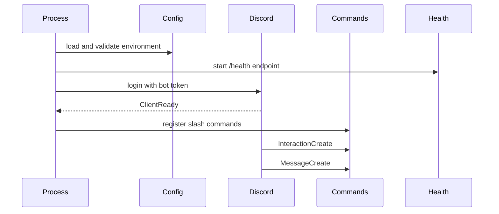

# Architecture

Restore-Base is intentionally small, but it follows the same shape used by larger Discord services: validate configuration first, isolate command behavior, expose health independently, and keep process startup easy to reason about.

## Runtime Flow

## Design Principles

- Fail fast when required environment variables are missing.
- Keep command registration separate from event wiring.
- Prefer typed boundaries over hidden process globals.
- Keep the health server independent from Discord events.
- Leave advanced persistence, queues, billing, and dashboards out of this public wrapper.

## Extension Points

- Add slash commands in `src/commands.ts`.
- Add feature modules under `src/modules`.
- Add storage through a small adapter rather than calling a database directly from event listeners.
- Add logging by replacing `console` calls with a logger interface.

## Non-Goals

This repo is not a full RestoreBase source release. It does not include private workspace code, production data flows, customer-specific automation, or the hosted recovery product.
